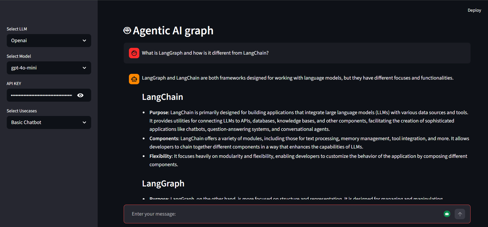
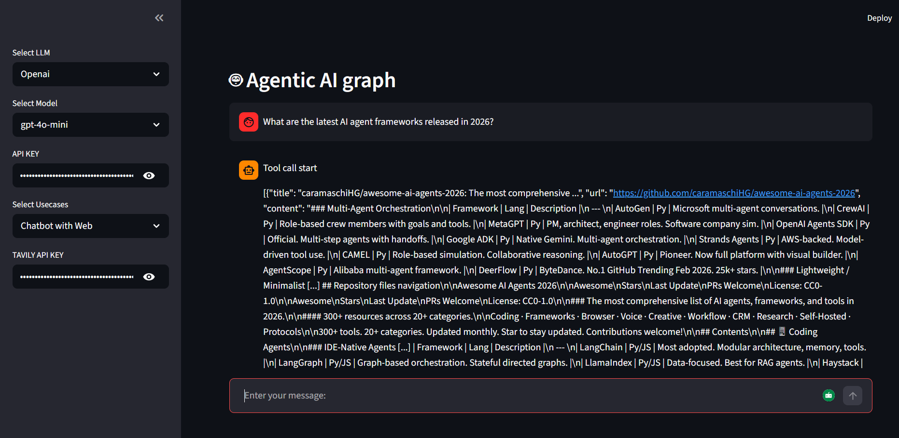
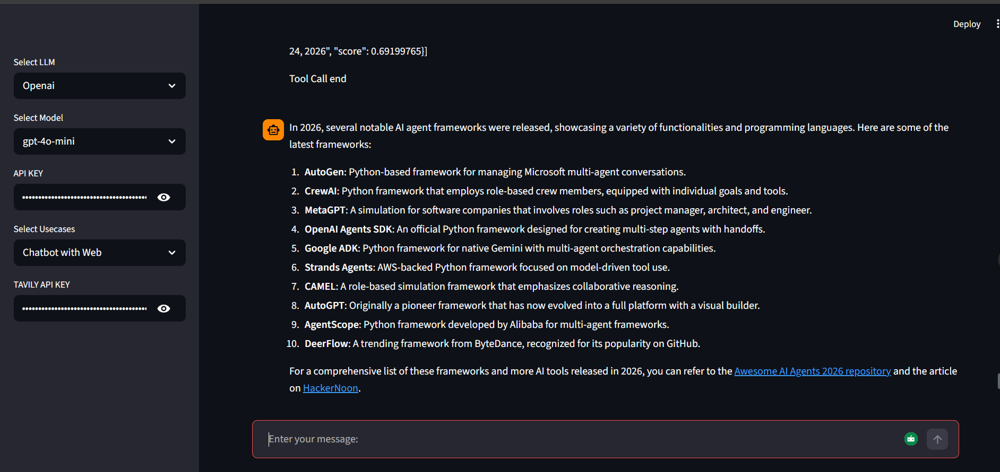
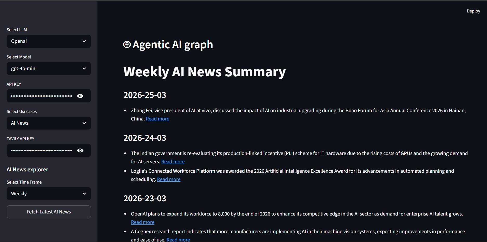

# Agentic Chatbot

A multi-usecase AI agent application built with **LangGraph** and **Streamlit**, demonstrating progressively complex agentic patterns — from a simple chatbot to an autonomous AI news aggregator.

---

## Features

| Usecase                     | Description                                                      |
| --------------------------- | ---------------------------------------------------------------- |
| **Basic Chatbot**           | Conversational AI with persistent message history                |
| **Chatbot with Web Search** | Agentic chatbot that decides when to search the web using Tavily |
| **AI News Aggregator**      | Autonomous pipeline that fetches, summarizes, and saves AI news  |

---

## Tech Stack

- **[LangGraph](https://github.com/langchain-ai/langgraph)** — Graph-based agent orchestration
- **[LangChain](https://github.com/langchain-ai/langchain)** — LLM orchestration framework
- **[OpenAI](https://platform.openai.com/)** — LLM backend (`gpt-4o`, `gpt-4o-mini`)
- **[Tavily](https://tavily.com/)** — Web search and news retrieval API
- **[Streamlit](https://streamlit.io/)** — Web UI
- **Python 3.12**

---

## Project Structure

```
Agentic_Chatbot/
├── app.py                          # Entry point
├── pyproject.toml                  # Project metadata & dependencies
├── AINews/                         # Auto-generated news summaries
│   ├── daily_summary.md
│   └── weekly_summary.md
└── src/
    └── langgraph_agentic_ai/
        ├── main.py                 # Core app logic
        ├── LLMs/
        │   └── openaillm.py        # OpenAI LLM initialization
        ├── graph/
        │   └── graph_builder.py    # LangGraph graph construction
        ├── nodes/
        │   ├── basic_chatbot_node.py
        │   ├── chatbot_with_tool_node.py
        │   └── ai_news_node.py
        ├── state/
        │   └── state.py            # Shared graph state schema
        ├── tools/
        │   └── search_tool.py      # Tavily search tool wrapper
        └── ui/
            ├── uiconfigfile.ini    # UI configuration
            ├── uiconfigfile.py     # Config loader
            └── streamlitui/
                ├── loadui.py       # Sidebar controls & inputs
                └── display_results.py  # Result rendering
```

---

## Architecture

The application follows a **node-and-graph architecture** powered by LangGraph. Each usecase is implemented as a distinct graph topology:

### Basic Chatbot

```
START → Chatbot Node → END
```

### Chatbot with Web Search (Agentic Loop)

```
START → Chatbot Node → (tool call?) → Tools Node → Chatbot Node → END
                     ↘ (no tool call) → END
```

### AI News Aggregator (Sequential Pipeline)

```
START → Fetch News → Summarize News → Save to File → END
```

---

## Screenshots

### Basic Chatbot


### Chatbot with Web Search



### AI News Aggregator


---

## Prerequisites

- Python 3.12
- An **OpenAI API key** — required for all usecases
- A **Tavily API key** — required for _Chatbot with Web_ and _AI News_ usecases

---

## Installation

```bash
# Clone the repository
git clone https://github.com/souravnagesh/Agentic-Chatbot.git
cd Agentic_Chatbot

# Create and activate a virtual environment
python -m venv .venv
source .venv/bin/activate        # macOS/Linux
.venv\Scripts\activate           # Windows

# Install dependencies
pip install -e .
```

> **Note:** This project uses `uv` for dependency management. If you have `uv` installed, run `uv sync` instead.

---

## Running the App

```bash
streamlit run app.py
```

The app will open at `http://localhost:8501`.

---

## Usage

1. **Configure the sidebar:**

   - Select an LLM (OpenAI)
   - Choose a model (`gpt-4o-mini` or `gpt-4o`)
   - Enter your OpenAI API key
   - Select a usecase

2. **For Basic Chatbot:** Type a message and press Enter.

3. **For Chatbot with Web Search:** Enter your Tavily API key, then chat. The agent will autonomously decide when to search the web.

4. **For AI News:** Enter your Tavily API key, select a timeframe (Daily / Weekly / Monthly), and click **Fetch Latest AI News**. Summaries are saved to `AINews/`.

---

## Environment Variables

Create a `.env` file in the project root to pre-load API keys (optional — they can also be entered via the UI):

```env
OPENAI_API_KEY=your_openai_api_key
TAVILY_API_KEY=your_tavily_api_key
```

---

## Generated News Output Format

The AI News aggregator saves summaries in Markdown:

```markdown
# Daily AI News Summary

### 2026-03-26

- GPT-5 released with multimodal capabilities (https://source-url.com)
- ...
```

---

## Dependencies

| Package               | Purpose                         |
| --------------------- | ------------------------------- |
| `langgraph`           | Graph-based agent orchestration |
| `langchain`           | LLM orchestration               |
| `langchain-openai`    | OpenAI integration              |
| `langchain-community` | Community tools (Tavily)        |
| `streamlit`           | Web UI                          |
| `tavily-python`       | Web search API                  |
| `python-dotenv`       | `.env` file support             |
| `pydantic`            | Data validation                 |

---

## License

This project is open-source and available under the [MIT License](LICENSE).
